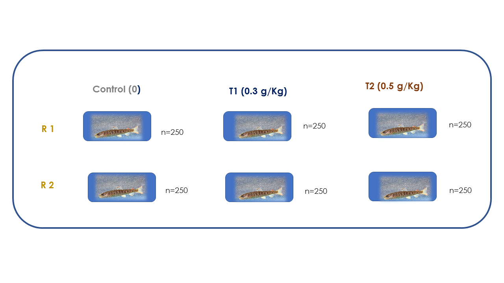

```{r setup, include=FALSE, comment=FALSE}
knitr::opts_chunk$set(echo = FALSE)
library(knitr)
library(kableExtra)
library(ggplot2)
library(dplyr)
library(readxl)
library(survival)
library(survminer)
library(ggpubr)
library(tidyverse)
install.packages("DescTools")
install.packages("nparcomp") 
library(car)
library(DescTools)
library("nparcomp")
library(lmtest)
library(knitr)
```

## ANTECEDENTES

**Introducción**

- La acuicultura en Perú es una importante actividad económica. 
- La trucha arcoíris (*Oncorhynchus mykiss*) es la principal especie cultivada, siendo Puno el primer departamento productor[^1]. 
- La mortalidad en alevinaje es una limitante para su desarrollo.
- Uso de antimicrobianos de forma indiscriminada.


**En ese sentido, la presente propuesta busca introducir alternativas preventivas que disminuyan estos índices y mejoren los parámetros productivos**.

[^1]: RNIA, Ministerio de la Producción. 2022. Estadística. http://www.https://rnia.produce.gob.pe/

## HIPÓTESIS
La inclusión de aceite de orégano en la dieta aumenta los parámetros productivos y disminuye la mortalidad en trucha arcoíris (*O. mykiss*)

## DISEÑO EXPERIMENTAL
```{r, echo=FALSE, out.width = '100%', fig.align='center'}

```


## ANÁLISIS ESTADÍSTICO
```{r biometría, echo = FALSE}
biometría<-read_excel("Datos_biometría.xlsx", sheet=1)
mortalidad <- read_excel("data_mortalidad.xls", sheet = 2)
```

**1).** **Evaluación de supuestos**

- *Independencia*: 
No cumple
- *Homocedasticidad*: 
No cumple (p<0.05)
- *Normalidad*: 
No cumple (p<0.05)

**2).** **Prueba de Kruskal Wallis**

Hay evidencia estadística para decir que al menos un grupo sometido a diferentes dosis difiere en peso de los otros grupos (p<0.05)

**3).** **Prueba de Comparaciones Múltiples**

Los grupos sometidos a dosis de 0.3 g/Kg y 0.5 g/Kg difieren en peso significativamente del grupo control (p<0.05).

## ANÁLISIS DE SUPERVIVENCIA
```{r supervivencia, echo = FALSE}
surv_obj <- Surv(mortalidad$survival_time, mortalidad$survival_status)

# Calculando la probabilidad de sobrevivencia de Kaplan-Meier y otras.
ps <- survfit(Surv(survival_time, survival_status) ~ tratamiento,
              data=mortalidad, na.action= na.exclude,type="kaplan-meier")

# Probando si existen o no diferencias entre dos o más curvas de sobrevivencia
test_surv <- survdiff(formula=Surv(survival_time, survival_status) ~ tratamiento, data=mortalidad)
```

```{r, out.width='80%', error=FALSE, warning=FALSE, message=FALSE}
gráfica<-ggsurvplot(ps, data=mortalidad, conf.int = FALSE, pval = TRUE, ggtheme = theme_bw())
```

```{r, out.width = '80%', error=FALSE, warning=FALSE, message=FALSE, fig.align='center', fig.cap="Mortalidad acumulada en trucha arcoíris alimentadas con aceite de orégano (T1 y y T2) vs control."}
 
gráfica
```

## CONCLUSIÓN
La inclusión en la dieta de aceite de orégano mejora los parámetros productivos (peso) y disminuye la mortalidad en trucha arcoíris, encontrando el mejor efecto con la dosis de 0.3g/Kg.


